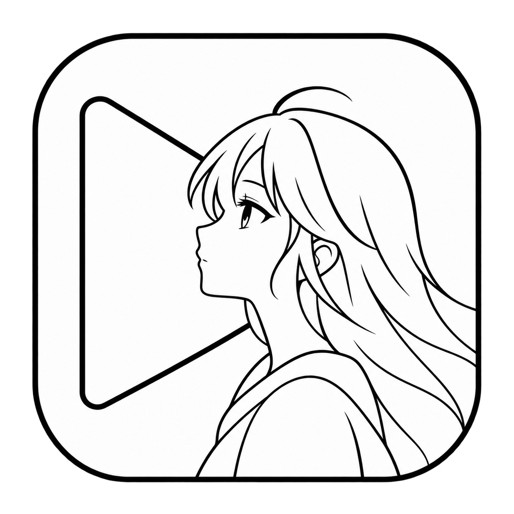

<p align="center">
  
</p>
<h1 align="center">Eikura</h1>
<p align="center">面向 Windows 的原生个人影音库，为日本动漫与日剧而生。</p>
<p align="center">
  <a href="https://github.com/KiYouJyo/Eikura/releases/latest"></a>
  <a href="https://github.com/KiYouJyo/Eikura/actions/workflows/repository-validation.yml"></a>
  <a href="https://github.com/KiYouJyo/Eikura"></a>
  <a href="#系统要求"></a>
  <a href="#语言"></a>
  <a href="#隐私与联网"></a>
  <a href="https://kiyoujyo.github.io/Eikura/"></a>
</p>
<p align="center">
  <a href="https://get.microsoft.com/installer/download/9N1PTDCCND8S?referrer=appbadge"></a>
</p>
<p align="center">简体中文 | <a href="README.ja-JP.md">日本語</a> | <a href="README.en-US.md">English</a></p>

## 简介

面向 Windows 的原生个人影音库。优先优化日本动漫与日剧，同时兼容电影、剧集和其他个人媒体；围绕媒体识别、元数据、播放、WebDAV、缓存与追番体验构建。

## 获取应用

- [Microsoft Store（推荐）](https://apps.microsoft.com/detail/9N1PTDCCND8S)：由商店管理安装与更新，无需手动配置发布证书。
- [GitHub 侧载版](https://github.com/KiYouJyo/Eikura/releases/latest)：提供 `Eikura-v*-x64-one-click.zip`、签名 MSIXBundle 与校验清单。
- [项目主页](https://kiyoujyo.github.io/Eikura/)：查看当前版本、功能概览、下载入口与支持信息。
- 高级用户可在 Release Assets 中直接下载签名的 `.msixbundle` 与 `SHA256SUMS.txt` 进行手动部署和校验。

## 核心功能

- **原生媒体库**：本地与 WebDAV 媒体来源、扫描、分类、作品/季度/剧集聚合。
- **日本媒体优先识别**：处理季、集、OVA/OAD/ONA/SP、发布组和常见技术标签，并保留原生标题。
- **真实元数据**：以 TMDB、Bangumi 等数据源补全海报、背景图、简介、季集信息、演职人员与作品信息。
- **播放体验**：LibVLC 后端，进度记忆、拖动、倍速、全屏、播放队列及常见视频格式。
- **字幕**：外挂 ASS/SSA/SRT，内封字幕统一渲染，并支持双字幕与首选语言。
- **缓存与下载**：远程视频可加入缓存页，查看下载进度、暂停、继续与离线播放。
- **Bangumi**：放送日历、发现、追番/收藏及账户相关能力。
- **Windows 原生体验**：WinUI 3、Mica、浅色/深色主题、三语界面与高 DPI 视觉资产。

## 安装与更新

### Microsoft Store 安装（推荐）

打开 [Microsoft Store 商品页面](https://apps.microsoft.com/detail/9N1PTDCCND8S) 安装 Eikura。商店版与 GitHub 侧载版使用各自的更新渠道。1.3.4 商店更新已提交审核，实际可用版本以商店页面为准。

### 首次 GitHub 安装

从 [最新 Release](https://github.com/KiYouJyo/Eikura/releases/latest) 下载一键安装包，解压后按包内说明安装。它包含所需安装脚本与发布证书处理流程。

### 后续更新

Microsoft Store 版通过商店更新；从 1.3.4 起，也可在应用“关于”页检查并安装商店更新。GitHub 侧载版通过 GitHub Releases 获取应用更新，安装前进行完整性与签名校验。两端均只保留应用本体更新，Metadata 随应用统一交付。

### 手动校验

Release 同时提供签名的 MSIXBundle 与 `SHA256SUMS.txt`。需要手工部署、归档或验证时可直接使用这些文件。

## 隐私与联网

Eikura 采用本地优先设计。媒体库索引、设置和播放历史默认保存在本机，不会把本地视频上传到 Eikura 自有服务器。使用元数据、Bangumi、更新检查或用户配置的 WebDAV 等联网功能时，应用会访问对应第三方服务或媒体来源。

详见 [隐私说明](PRIVACY.md)。

## 系统要求

- Windows 10 2004 或更高版本 / Windows 11
- x64
- Windows App SDK Runtime（安装流程会按需要处理运行环境）

## 语言

支持简体中文、日本語与 English，三套资源键保持一致。

## 文档

- [项目主页](https://kiyoujyo.github.io/Eikura/)
- [路线图](docs/ROADMAP.md)
- [架构](docs/ARCHITECTURE.md)
- [播放集成](docs/PLAYBACK_INTEGRATION.md)
- [本地化规范](docs/LOCALIZATION.md)
- [UI 规范](docs/UI_GUIDELINES.md)
- [发布流程](docs/RELEASE.md)
- [更改日志](CHANGELOG.md)
- [隐私说明](PRIVACY.md) · [贡献指南](CONTRIBUTING.md) · [安全政策](SECURITY.md)

## 开发与构建

```powershell
dotnet restore Eikura.slnx
dotnet test Eikura.slnx -c Debug
```

WinUI 3 x64 Release 构建、签名、MSIXBundle 与 GitHub Release 发布流程见 [docs/RELEASE.md](docs/RELEASE.md)。

## 问题反馈

请通过 [GitHub Issues](https://github.com/KiYouJyo/Eikura/issues) 反馈问题，或访问[支持页面](https://kiyoujyo.github.io/Eikura/support/)。

---

Eikura
